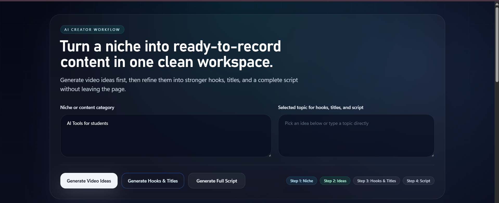
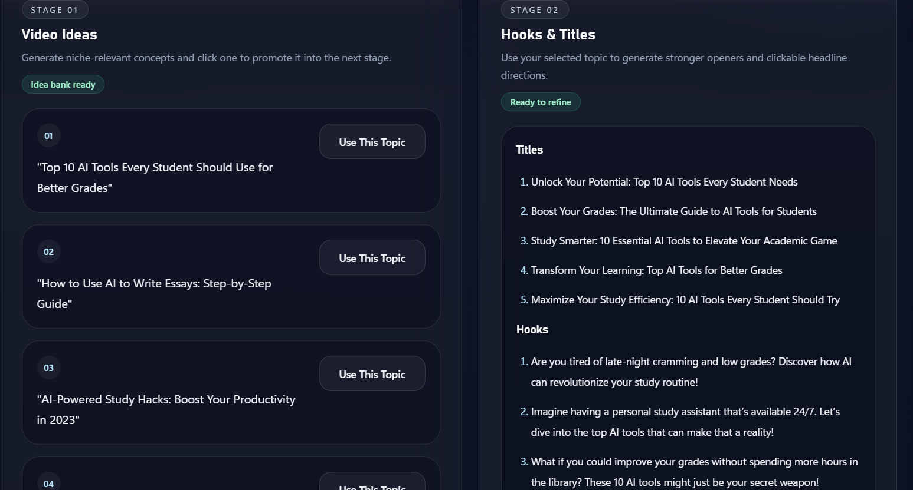
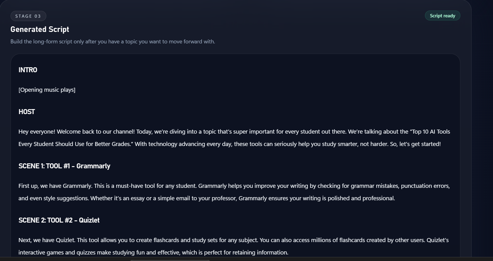

# AI Creator Copilot

AI Creator Copilot is an AI-powered workflow tool built during the OpenAI × Outskill AI Builders Hackathon.

The platform helps creators move from niche/topic selection to ready-to-record video scripts using AI-assisted workflows.

---

# Screenshots

## Main Workflow UI



## Video Ideas & Hooks & Titles Generation




## Script Generation



---

# Features

- Generate YouTube video ideas from a niche/topic
- Generate engaging hooks and titles
- Generate complete YouTube video scripts
- Workflow-based creator experience
- Modern AI SaaS-style UI
- FastAPI + Next.js integration
- AI-assisted development workflow using Codex

---

# Workflow

1. Enter niche/topic  
2. Generate video ideas  
3. Select a topic  
4. Generate hooks & titles  
5. Generate full script  

---

# Tech Stack

## Frontend
- Next.js
- Tailwind CSS

## Backend
- FastAPI
- LangChain
- OpenAI API

---

# Project Structure

```bash
backend/
frontend/
BUILD_LOG.md
README.md
```

---

# Local Setup

## Backend Setup

```bash
cd backend

pip install -r requirements.txt

uvicorn main:app --reload
```

Backend runs on:

```bash
http://127.0.0.1:8000
```

---

## Frontend Setup

```bash
cd frontend

npm install

npm run dev
```

Frontend runs on:

```bash
http://localhost:3000
```

---

# AI-Assisted Development

This project was developed with the help of:
- ChatGPT
- OpenAI Codex
- AI-assisted debugging and workflow iteration

AI tools were used for:
- Frontend generation
- API integration
- UI improvements
- Debugging
- Workflow refinement
- Formatting fixes

---

# Current MVP Status

Completed MVP workflow:
- Idea Generation
- Topic Selection
- Hooks & Titles
- Script Generation

The project is currently functional and demo-ready.

---
